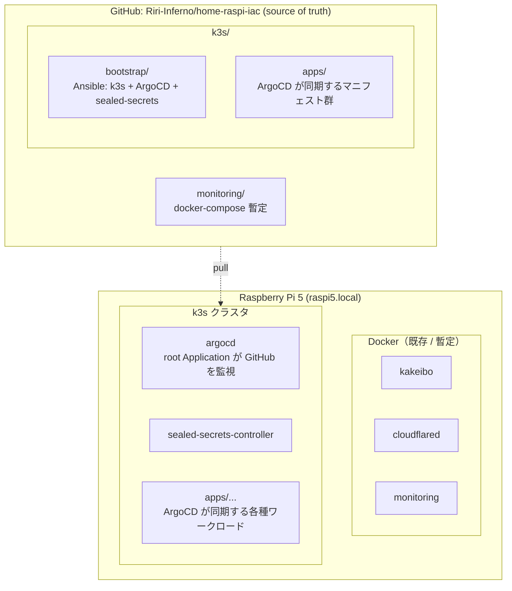

# home-raspi-iac

自宅サーバ（Raspberry Pi 5）を **IaC + GitOps** で再現可能に管理するリポジトリ。
このリポジトリのマニフェストを source of truth とし、ラズパイ側は ArgoCD 経由で pull 同期するモデル。

## 構成



## 採用技術と役割

| レイヤ | ツール | 役割 |
|---|---|---|
| ハードウェア / OS | Raspberry Pi 5 + Raspberry Pi OS | 物理ホスト（手動セットアップ） |
| プロビジョニング | **Ansible** | k3s 本体 + 基盤コンポーネントの初期構築（冪等） |
| オーケストレーション | **k3s** | 軽量 Kubernetes |
| GitOps | **ArgoCD** | リポジトリ → クラスタの同期、UI 付き |
| シークレット管理 | **sealed-secrets**（Bitnami） | Git に乗せられる暗号化 Secret |
| 監視（暫定） | Prometheus + Grafana + node-exporter + cAdvisor | docker-compose で運用中、k3s 化予定 |

## ディレクトリ

- [`monitoring/`](monitoring/) — ホストマシンの監視スタック（docker-compose）。詳細は [monitoring/README.md](monitoring/README.md)
- [`k3s/`](k3s/) — Kubernetes 関連。詳細は [k3s/README.md](k3s/README.md)
  - `k3s/bootstrap/` — Ansible playbook（k3s + ArgoCD + sealed-secrets を install）
  - `k3s/apps/` — ArgoCD が同期する Kubernetes マニフェスト
- [`.github/`](.github/) — PR テンプレート

## クイックスタート（クラスタ構築）

開発マシン側に Ansible が必要（`pipx install --include-deps ansible` 等）。
ラズパイへの SSH 公開鍵認証が通ること（`ssh-copy-id riri-inferno@raspi5.local`）。

```bash
cd k3s/bootstrap
ansible-playbook -i inventory.ini site.yml
```

これで k3s クラスタ + sealed-secrets + ArgoCD + 本リポジトリを監視する root Application が立ち上がる。以降 `k3s/apps/` にマニフェストを push すれば自動同期。

## アクセス（暫定）

| サービス | アクセス |
|---|---|
| ArgoCD UI | port-forward 経由で `https://raspi5.local:8443/`（admin / 別管理） |
| Grafana | `http://raspi5.local:3001/`（admin / 別管理） |
| Prometheus | `http://raspi5.local:9090/` |

正式な公開ルート（Cloudflare Tunnel 経由 or Ingress 化）は今後の TODO。

## 運用方針

- **実機にソースを置かない**: イメージは外部レジストリから pull する pull 型運用
- **シークレットは平文で commit しない**: `kubeseal` で暗号化した SealedSecret のみリポジトリへ
- **再構築前提**: Ansible playbook + sealed-secrets 鍵バックアップで全体を再現可能に保つ

## 今後の追加予定

- [ ] ArgoCD の外部公開（Cloudflare Tunnel 経由 / Cloudflare Access で認証ゲート）
- [ ] `monitoring/` を docker-compose から k3s マニフェストへ移行
- [ ] コンテナレジストリ確定（GHCR or セルフホスト）
- [ ] SSD 化（HW 調達後の別プロジェクト）
