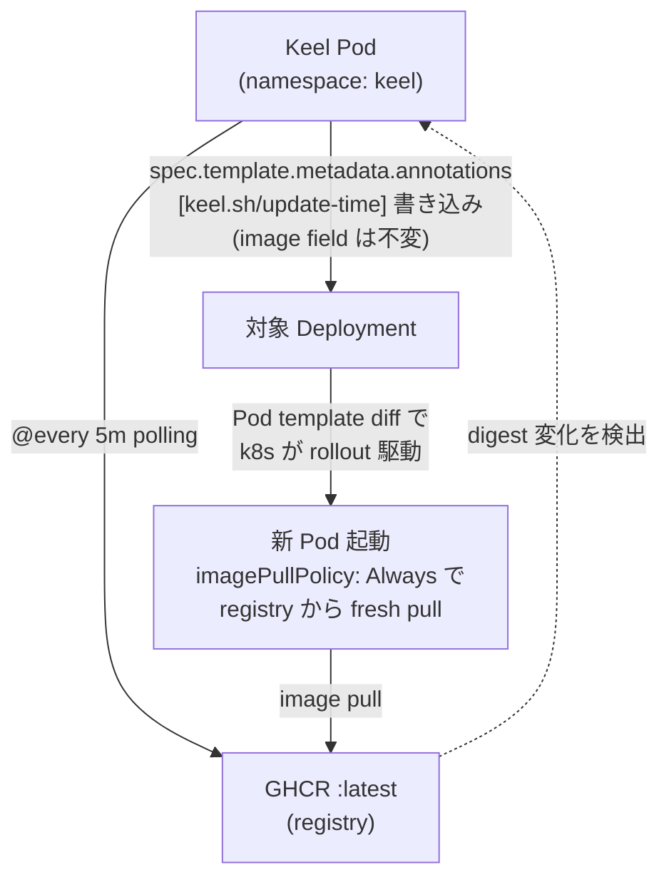

# Kubernetes Stack - Home Raspi

ラズパイ5（ホストマシン）の k3s クラスタおよび GitOps スタック。  
このリポジトリのマニフェストを source of truth とし、ラズパイ側は ArgoCD で pull 同期する。

## 構成

| コンポーネント       | 役割                                       | 備考                  |
|--------------------|-------------------------------------------|----------------------|
| k3s                | 軽量 Kubernetes ディストリビューション        | API: `:6443`         |
| ArgoCD             | GitOps コントローラ（Web UI 付き）           | Cloudflare Tunnel 経由公開（`argocd.riri-inferno.com`） |
| sealed-secrets     | Git に乗せる Secret の暗号化コントローラ      | Bitnami              |
| Reloader           | ConfigMap/Secret 変更時に対応 Deployment を rollout | Stakater Helm chart |
| Keel               | image registry の `:latest` digest 変化を polling → 該当 Deployment を rollout（git は触らない） | keel.sh Helm chart |
| Ansible            | k3s 本体・基盤コンポーネントの初期インストール | `bootstrap/` 配下    |

## レイヤ分担

| レイヤ                              | ツール                       |
|------------------------------------|-----------------------------|
| ハードウェア / OS インストール        | 手動（Raspberry Pi Imager）  |
| k3s インストール / ノード設定         | **Ansible**                 |
| ArgoCD / sealed-secrets の初期投入   | Ansible                     |
| アプリ・監視スタック等                | k3s マニフェスト + ArgoCD    |

## ブートストラップ

### 前提

- 操作端末（コントローラ）に **Ansible** がインストールされている
- ラズパイへ SSH 公開鍵認証で接続できる（ユーザー: `riri-inferno`）
- ラズパイ側で `sudo` がパスワードなしで使える（または `--ask-become-pass` を付けて実行）

### 実行

```bash
cd k3s/bootstrap
ansible-playbook -i inventory.ini site.yml
# sudo パスワードが必要な場合:
# ansible-playbook -i inventory.ini site.yml --ask-become-pass
```

これで以下が冪等にインストールされる:

- k3s（サーバノード）
- sealed-secrets コントローラ
- ArgoCD
- 本リポジトリを監視する ArgoCD `Application`（`root`）

以降、`k3s/apps/` 配下のマニフェストを push すれば ArgoCD が自動で同期する。

## アクセス

- ArgoCD UI: port-forward 経由で `https://raspi5.local:8443/`
  - 初期パスワード（リセット前）: `kubectl -n argocd get secret argocd-initial-admin-secret -o jsonpath='{.data.password}' | base64 -d`
  - 現状: SealedSecret 管理（個人パスワードマネージャ）
- kubectl: `/etc/rancher/k3s/k3s.yaml` を `~/.kube/config` に取り込む（または raspi 上で `sudo k3s kubectl ...`）

## ディレクトリ構成

```
k3s/
├── README.md
├── bootstrap/                # Ansible: k3s + クラスタ基盤の初期構築
│   ├── inventory.ini
│   ├── site.yml
│   ├── group_vars/
│   │   └── all.yml           # repo URL / ブランチ / 各種バージョン
│   └── roles/
│       ├── k3s/
│       ├── sealed-secrets/
│       └── argocd/           # 本体 install + 自リポジトリ監視 root Application
└── apps/
    ├── _apps/                # 子 Application マニフェスト群（root が同期する対象）
    │   ├── argocd.yaml       # Application: argocd → k3s/apps/argocd/
    │   ├── cloudflared.yaml  # Application: cloudflared → k3s/apps/cloudflared/
    │   ├── kakeibo.yaml      # Application: kakeibo → k3s/apps/kakeibo/
    │   ├── keel.yaml         # Application: keel → keel.sh Helm chart（path 配下なし）
    │   ├── monitoring.yaml   # Application: monitoring → k3s/apps/monitoring/
    │   ├── oidc.yaml         # Application: oidc → k3s/apps/oidc/
    │   └── reloader.yaml     # Application: reloader → stakater Helm chart（path 配下なし）
    ├── argocd/               # ArgoCD 自身の SealedSecret（admin password）
    ├── cloudflared/          # ArgoCD / kakeibo / oidc 外部公開用 cloudflared
    ├── kakeibo/              # 家計簿アプリ（namespace / SA / WIF / postgres / backend / frontend）
    ├── monitoring/           # Prometheus / Grafana / node-exporter / cAdvisor
    └── oidc/                 # WIF 用 OIDC discovery 静的配信（nginx）
```

## ArgoCD 構造（App of Apps）

| Application | 範囲 | 担当 path / source |
|---|---|---|
| `root` | `_apps/` のみ監視。子 Application を作る／消す | `k3s/apps/_apps/` |
| `argocd` | argocd ns 内の SealedSecret 等 | `k3s/apps/argocd/` |
| `cloudflared` | k3s tunnel 用 cloudflared 一式 | `k3s/apps/cloudflared/` |
| `kakeibo` | 家計簿アプリ一式（namespace / SA / WIF / postgres / backend / frontend） | `k3s/apps/kakeibo/` |
| `keel` | image 自動追従 controller | Helm chart `https://charts.keel.sh` |
| `monitoring` | Prometheus / Grafana / exporter 群 | `k3s/apps/monitoring/` |
| `oidc` | WIF 用 OIDC discovery 静的配信（nginx） | `k3s/apps/oidc/` |
| `reloader` | ConfigMap/Secret 変更時の自動 rollout | Helm chart `https://stakater.github.io/stakater-charts` |

- root は `prune: false`（誤削除防止、子 Application 単位の手動確認を要請）
- 各子 Application は `prune: true`（実 resource を厳密に管理）
- 新アプリ追加 = `_apps/<name>.yaml` と `<name>/` 配下のマニフェストを 2 セットで足す（Helm chart で展開する場合は path 配下なしで `_apps/<name>.yaml` のみ）

---

## 運用ガイド

### 新しいアプリを追加する

App of Apps パターンなので **2 セット** 作る：実体マニフェスト群 + それを管理する子 Application。

1. **feature ブランチ作成**:
   ```bash
   git checkout -b feature/<app-name>
   ```

2. **実体マニフェストを `k3s/apps/<app-name>/` に配置**:
   - 必要に応じて `namespace.yaml` / `deployment.yaml` / `service.yaml` / `pvc.yaml` 等
   - シークレットが必要なら次セクション「Secret を SealedSecret 化する」を参照

3. **子 Application マニフェストを `k3s/apps/_apps/<app-name>.yaml` に配置**:
   既存の `_apps/monitoring.yaml` 等をコピーし、`name`、`spec.source.path`、`spec.destination.namespace` を新アプリ用に書き換える。テンプレ:
   ```yaml
   apiVersion: argoproj.io/v1alpha1
   kind: Application
   metadata:
     name: <app-name>
     namespace: argocd
     finalizers:
       - resources-finalizer.argocd.argoproj.io
   spec:
     project: default
     source:
       repoURL: https://github.com/Riri-Inferno/home-raspi-iac.git
       targetRevision: develop
       path: k3s/apps/<app-name>
       directory:
         recurse: true
     destination:
       server: https://kubernetes.default.svc
       namespace: <app-namespace>
     syncPolicy:
       automated:
         prune: true
         selfHeal: true
       syncOptions:
         - CreateNamespace=true
   ```

4. **構文チェック（任意だが推奨）**:
   ```bash
   ssh riri-inferno@raspi5.local 'sudo k3s kubectl apply --dry-run=server -f -' \
     < k3s/apps/_apps/<app-name>.yaml
   # 実体側もそれぞれ流す
   ```

5. **PR 作成 → develop マージ**:
   ```bash
   git add k3s/apps/<app-name> k3s/apps/_apps/<app-name>.yaml
   git commit -m "..."
   git push -u origin feature/<app-name>
   gh pr create --base develop ...
   ```

6. **ArgoCD 同期確認**:
   - 自動 sync は **3 分間隔** のポーリング。急ぎなら手動 refresh:
     ```bash
     ssh riri-inferno@raspi5.local \
       'sudo k3s kubectl -n argocd annotate application root argocd.argoproj.io/refresh=hard --overwrite'
     ```
   - 状態確認:
     ```bash
     ssh riri-inferno@raspi5.local 'sudo k3s kubectl -n argocd get applications'
     ssh riri-inferno@raspi5.local 'sudo k3s kubectl get all -n <namespace>'
     ```
   - root が `_apps/<name>.yaml` を見つけて子 Application を作り、その子が実体を sync する流れ

### Secret を SealedSecret 化する

平文 Secret は **絶対にコミットしない**。`kubeseal` で暗号化した `SealedSecret` だけが Git に乗る。

#### 前提（初回のみ）

- `kubeseal` CLI を controller と同じバージョンで install（現状 `v0.27.3`）:
  ```bash
  URL='https://github.com/bitnami-labs/sealed-secrets/releases/download/v0.27.3/kubeseal-0.27.3-linux-amd64.tar.gz'
  curl -L "$URL" -o /tmp/kubeseal.tar.gz
  tar -xzf /tmp/kubeseal.tar.gz -C /tmp/ kubeseal
  sudo install -m 755 /tmp/kubeseal /usr/local/bin/kubeseal
  ```
- クラスタの公開鍵を取得しローカル保存:
  ```bash
  mkdir -p ~/.config/sealed-secrets
  ssh riri-inferno@raspi5.local \
    "sudo k3s kubectl -n kube-system get secret -l sealedsecrets.bitnami.com/sealed-secrets-key=active -o jsonpath='{.items[0].data.tls\.crt}'" \
    | base64 -d > ~/.config/sealed-secrets/cert.pem
  ```

#### 毎回の手順

1. **平文 Secret を `/tmp/` に作成**（リポジトリには絶対置かない）:
   ```bash
   cat > /tmp/<name>-secret.yaml <<'EOF'
   apiVersion: v1
   kind: Secret
   metadata:
     name: <name>
     namespace: <ns>
   type: Opaque
   stringData:
     key: '<value>'   # bcrypt ハッシュ等の `$` を含む値はシングルクォート必須
   EOF
   ```

2. **kubeseal で暗号化**:
   ```bash
   kubeseal --cert ~/.config/sealed-secrets/cert.pem -o yaml \
     < /tmp/<name>-secret.yaml \
     > k3s/apps/<app>/<name>.yaml
   ```

3. **平文ファイルを削除**:
   ```bash
   rm -f /tmp/<name>-secret.yaml
   ```

4. **コミット → PR → merge** すると、ArgoCD 同期で SealedSecret が cluster に届き、controller が復号して通常の Secret を作成。Pod から `secretKeyRef` で参照。

#### 既存の Secret を乗っ取る場合（注意）

ArgoCD install で先に作られた `argocd-secret` のような **既に存在するが SealedSecret 管理ではない Secret** を乗っ取りたいときは、初手で衝突する。確実な方法は：

1. SealedSecret マニフェストに annotation を追加:
   ```yaml
   metadata:
     annotations:
       sealedsecrets.bitnami.com/managed: "true"
   ```
2. 既存 Secret を **削除** + sealed-secrets controller を **再起動**:
   ```bash
   ssh riri-inferno@raspi5.local '
     sudo k3s kubectl -n <ns> delete secret <name>
     sudo k3s kubectl -n kube-system rollout restart deployment sealed-secrets-controller
   '
   ```
   → controller が「SealedSecret あり、Secret 無し」を検知して新規作成（owner reference 付き）

#### 重要: master key のオフラインバックアップ

クラスタを再構築すると sealed-secrets の private key も再生成され、**既存の SealedSecret は復号できなくなる**。鍵をオフライン（パスワードマネージャ等）に必ず保管すること。

```bash
ssh riri-inferno@raspi5.local \
  "sudo k3s kubectl get secret -n kube-system -l sealedsecrets.bitnami.com/sealed-secrets-key=active -o yaml" \
  > ~/sealed-secrets-master-key.yaml
# ↑ 安全な場所に保存後、開発マシンから消す（Git 厳禁）
```

復旧:
```bash
ssh riri-inferno@raspi5.local 'sudo k3s kubectl apply -f -' < <backup>.yaml
ssh riri-inferno@raspi5.local 'sudo k3s kubectl -n kube-system rollout restart deployment sealed-secrets-controller'
```

### 環境変数を変える

**ConfigMap（非機密）の場合**:

1. `k3s/apps/<app>/configmap.yaml` を編集
2. commit & PR & merge → ArgoCD 同期
3. **Reloader が自動で Pod を rollout restart**（deployment に `reloader.stakater.com/auto: "true"` が付いている前提）

急ぎ反映したいときは ArgoCD refresh annotation:
```bash
ssh riri-inferno@raspi5.local 'sudo k3s kubectl -n argocd annotate application <app> argocd.argoproj.io/refresh=hard --overwrite'
```

**SealedSecret（機密）の場合**:

平文値を編集する必要があるので **kubeseal を再実行** が必要。

```bash
# 1. 平文 Secret を /tmp に作成（既存値 + 変更したい値、全キー必要）
cat > /tmp/<name>-secret.yaml <<'EOF'
apiVersion: v1
kind: Secret
metadata:
  name: <name>
  namespace: <ns>
type: Opaque
stringData:
  KEY1: '...'
  KEY2: '<新しい値>'
EOF

# 2. kubeseal で再暗号化（既存ファイル上書き）
kubeseal --cert ~/.config/sealed-secrets/cert.pem -o yaml \
  < /tmp/<name>-secret.yaml \
  > k3s/apps/<app>/sealedsecret.yaml

# 3. 平文消す
rm -f /tmp/<name>-secret.yaml

# 4. 以降は ConfigMap と同じ：commit → PR → merge → ArgoCD 同期 → Reloader
```

> **注意**: SealedSecret は復号できないので、変更時は **全キーの平文値を再入力**する。値の控えはパスワードマネージャに保管する運用が定石。

### ログを見る

| 用途 | 手段 | 例 |
|---|---|---|
| 「アプリ生きてる？」のサクッと確認 | **ArgoCD UI** | Application → Pod アイコン → Logs タブ |
| エラー追跡（grep / `--previous`） | **`kubectl logs`** | `sudo k3s kubectl -n <ns> logs deploy/<name> --tail=100 --previous` |
| リアルタイム追従 | **`kubectl logs -f`** | `sudo k3s kubectl -n <ns> logs deploy/<name> -f` |
| ArgoCD 自身の挙動 | **`kubectl logs`**（UI には出にくい） | `sudo k3s kubectl -n argocd logs deploy/argocd-server` |
| Reloader 動作確認 | 同上 | `sudo k3s kubectl -n reloader logs deploy/reloader-reloader` |
| 数日前のログ遡り | **未対応**（Loki + Grafana 導入候補） | — |

ArgoCD UI 経由は `https://argocd.riri-inferno.com/` → Application 選択 → resource tree から Pod を click → ダイアログで Logs タブ。コンテナ切替もここで可能。

CLI フル機能版:
```bash
# 直近 100 行
ssh riri-inferno@raspi5.local 'sudo k3s kubectl -n <ns> logs deploy/<name> --tail=100'

# tail -f 相当
ssh riri-inferno@raspi5.local 'sudo k3s kubectl -n <ns> logs deploy/<name> -f'

# 1 つ前の Pod インスタンス（再起動後に直前ログ追跡）
ssh riri-inferno@raspi5.local 'sudo k3s kubectl -n <ns> logs deploy/<name> --previous'
```

### image 自動追従（Keel）

`:latest` のような mutable tag を運用するアプリで「registry を更新したら k3s 上の Pod も自動でロールアウト」を実現する仕組み。手動 `kubectl rollout restart` 不要。

**仕組み**:



**git は触らない**。意図的に「registry が真の source of truth」と扱う設計。digest pin で git に書き戻す Image Updater 系とは方針が逆（commit ノイズが残らない）。

**有効化（Deployment 側 annotation で opt-in）**:

```yaml
metadata:
  annotations:
    keel.sh/policy: force            # registry 更新で常に追従
    keel.sh/match-tag: "true"        # 同じ tag (=latest) の digest 変化のみ追従、tag 検知ではない
    keel.sh/trigger: poll            # webhook 不要、polling で動く
    keel.sh/pollSchedule: "@every 5m"
```

**ArgoCD selfHeal との両立**:

Keel は対象 Deployment の `spec.template.metadata.annotations[keel.sh/update-time]` に rollout の度に現在時刻を書き込む。これは Git 定義に存在しないため、selfHeal=true の Application では即座に巻き戻されてしまう。これを回避するため、**Keel 監視対象アプリの Application には `ignoreDifferences` でその annotation を除外**する:

```yaml
# _apps/<app>.yaml
spec:
  ignoreDifferences:
    - group: apps
      kind: Deployment
      jsonPointers:
        - /spec/template/metadata/annotations/keel.sh~1update-time   # ~1 = JSON Pointer の "/" エスケープ
```

これで selfHeal は引き続き image 等の重要フィールドを protect しつつ、Keel の trigger annotation だけは介入しない。

**動作確認**:

```bash
# Keel Pod 起動確認
ssh riri-inferno@raspi5.local 'sudo k3s kubectl -n keel get pods'

# 監視対象として認識しているか
ssh riri-inferno@raspi5.local 'sudo k3s kubectl -n keel logs deploy/keel --tail=100 | grep -i "tracked\|polling\|<deployment-name>"'

# 実際に rollout が走ったか（annotation が更新されているか）
ssh riri-inferno@raspi5.local 'sudo k3s kubectl -n <ns> get deploy <name> -o jsonpath="{.spec.template.metadata.annotations.keel\.sh/update-time}"'
```

**監視を解除したいとき**:

Deployment から `keel.sh/*` annotation 群を削除。`_apps/<app>.yaml` の `ignoreDifferences` も外して構わない（残しても害はない）。

**新規アプリで Keel 自動追従を有効化する流れ**:

1. アプリの Deployment に上記の `keel.sh/*` annotation を追加
2. `_apps/<app>.yaml` の Application に上記 `ignoreDifferences` を追加
3. PR → merge → ArgoCD 同期
4. Keel ログで対象 image を tracked と認識しているか確認

---

## クラスタ完全再構築の手順（SSD 故障 / 移植 / DR ドリル）

「Git = source of truth」の検証兼 DR ドリル。2026-05-07 に SD → NVMe 移植時に実施した手順を一般化したもの。

### 必須事前準備（再構築開始前）

1. **sealed-secrets master key の所在確認**（オフラインバックアップ。これが無いと SealedSecret 全件が復号不能で詰む）
2. **必要なら kakeibo-db の pg_dump を取り出す**（cluster 停止前に最終取得）
3. **OIDC JWKS の旧値を控える**（gotcha 避けの参考用）: `sudo k3s kubectl get --raw /openid/v1/jwks`

### Phase 1〜10 概観

| # | 内容 | 主体 |
|---|---|---|
| 1 | 新ストレージに Raspberry Pi OS Lite arm64 を flash + 初期設定（ssh / userconf.txt / hostname / cmdline.txt に **NVMe APST 対策** 追加） | user / agent |
| 2 | EEPROM の `BOOT_ORDER` を新ストレージ優先に変更（NVMe なら `0xf416`） | user / agent |
| 3 | 新ストレージから boot → SSH 疎通確認（known_hosts は事前クリーン） | agent |
| 4 | NOPASSWD sudo 設定（Ansible 実行のため、初回 1 回のみ tty で password 入力が必要） | user |
| 5 | `cd k3s/bootstrap && ansible-playbook -i inventory.ini site.yml` | user / agent |
| 6 | master key restore + sealed-secrets-controller rollout restart | agent |
| 7 | argocd-secret 衝突解消（既存 Secret delete + controller restart 再 reconcile） | agent |
| 8 | **OIDC JWKS の kid 変化** を `configmap-content.yaml` に反映する PR → merge | agent + user |
| 9 | kakeibo-db に pg_restore（root + kakeibo Application の selfHeal 一時 OFF → backend scale 0 → restore → scale 1 → selfHeal ON） | agent |
| 10 | 全 Application Synced/Healthy 確認、外部 DNS 経由動作確認、旧ストレージは数日 rollback 用に保管 | agent + user |

### 落とし穴

- **NVMe SSD APST バグ**: `/boot/firmware/cmdline.txt` 末尾に `nvme_core.default_ps_max_latency_us=0 pcie_aspm=off pcie_port_pm=off` を追加しないと controller が 5〜10 分で死ぬ（YEESTOR / Phison 系廉価 SSD で頻発）
- **OIDC JWKS の kid 変化**: k3s 完全再構築で SA signing key が新規発行 → JWKS の `kid` / `n` が変わる → `k3s/apps/oidc/configmap-content.yaml` を更新しないと WIF が壊れる（kakeibo backend の Vertex AI / GCS 呼び出し失敗）
- **selfHeal 階層**: pg_restore 等で一時的に Application の状態を Git と乖離させる場合、root + 子 Application 両方の selfHeal を OFF（root の selfHeal patch は ArgoCD に巻き戻されない、root 自身は cluster 内で唯一 unmanaged）
- **argocd-secret 衝突**: ArgoCD install 直後に作られる Secret は SealedSecret 管理ではない → SealedSecret の `argocd-secret` と衝突 → 既存 Secret 削除 + controller restart で SealedSecret から再生成
- **sudo password**: 新 OS は default で NOPASSWD sudo が無いので、Ansible 実行前に `/etc/sudoers.d/010-<user>-nopasswd` を仕込む

詳細は agent memory（`project_*` / `feedback_*`）と CLAUDE.md の「既知の制約・注意点」を参照。

---

## 今後の追加予定

- [ ] Loki / Promtail でログ集約（数日前のログ遡り問題）
- [ ] Alertmanager（Slack / LINE 通知）
- [ ] dashboard JSON の IaC 化（必要になったら、UI 完結でも可）
- [ ] Ansible playbook に NVMe APST 対策の cmdline 編集タスクを統合（再構築時の手作業を削減）
