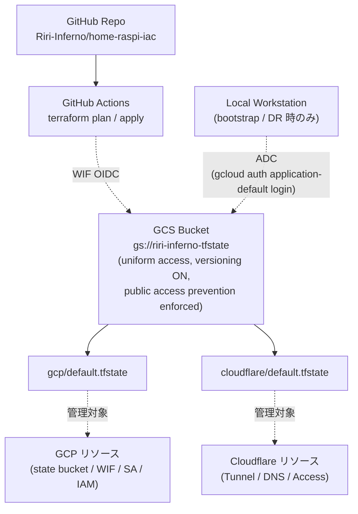
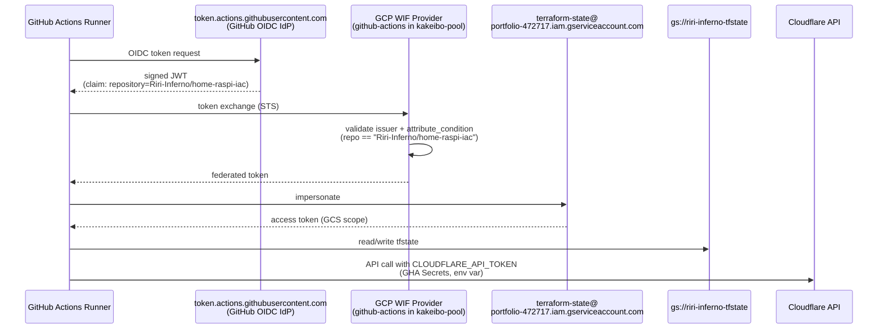
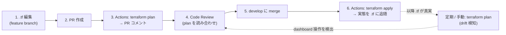

# Terraform Stack - Home Raspi

外部 SaaS（**GCP** / **Cloudflare**）側のリソースを Terraform で IaC 化するための一式。
リポジトリのこのディレクトリを source of truth とし、`apply` で外部 API を reconcile する。

> k3s / アプリ側の manifest は `k3s/` 配下（ArgoCD GitOps 担当）。本ディレクトリと k3s の責務は分かれている。

## 構成

| 領域 | 対象 | ディレクトリ |
|---|---|---|
| **GCP** | Terraform state を置く GCS bucket、CI 用 Workload Identity Federation、各 IAM binding | `terraform/gcp/` |
| **Cloudflare** | Tunnel / DNS / Access Application / Zero Trust 設定 | `terraform/cloudflare/` |

## レイヤ分担

| レイヤ | ツール |
|---|---|
| 外部 SaaS リソース（本ディレクトリ） | **Terraform** |
| k3s クラスタ・k8s manifest | k3s / ArgoCD（`k3s/` 配下） |
| ラズパイ本体（OS / ノード初期構築） | Ansible（`k3s/bootstrap/`） |
| アプリケーションコード | 別リポジトリ（kakeibo 等） |

## state backend - すべての state は GCS にある

Terraform state ファイル（リソースの現スナップショット、内部 ID + 全 attribute 値を保持）は **ローカルには置かず、GCP の GCS bucket に集約**。



| 項目 | 値 |
|---|---|
| Bucket | `riri-inferno-tfstate` |
| Location | `asia-northeast1` |
| Versioning | ON（壊した時に object 履歴から復元可） |
| Uniform bucket-level access | ON |
| Public access prevention | enforced |
| Prefix（領域別 state 分離） | `gcp/`、`cloudflare/` |
| Lock | GCS native（同時 apply は自動でブロック） |

state ファイルには resource attribute が **平文で** 入る（IAM の condition、SA 名等）。GCS の uniform access + public access prevention で防御している。**Git には絶対に乗らない**（`.gitignore` で `*.tfstate*` 全除外）。

## CI / CD - GitHub Actions

通常運用は **Actions に全部任せる**。ローカルから `terraform apply` は緊急時のみ。

### Workflow ファイル

| ファイル | trigger | 役割 |
|---|---|---|
| `.github/workflows/terraform-gcp-plan.yml` | PR で `terraform/gcp/**` 変更時、または manual | `terraform plan` → 結果を PR コメント |
| `.github/workflows/terraform-gcp-apply.yml` | `develop` への push で `terraform/gcp/**` 変更時、または manual | `terraform apply -auto-approve` |
| `.github/workflows/terraform-cf-plan.yml` | PR で `terraform/cloudflare/**` 変更時、または manual | `terraform plan` → 結果を PR コメント |
| `.github/workflows/terraform-cf-apply.yml` | `develop` への push で `terraform/cloudflare/**` 変更時、または manual | `terraform apply -auto-approve` |

各 workflow には `workflow_dispatch` も仕込んであり、Actions タブから手動 trigger 可能。

### 認証フロー（OIDC）



- **GCP 側に static SA private key は存在しない**（WIF + OIDC のみ）
- **Cloudflare API token のみ手動 rotation**: GHA Secrets `CLOUDFLARE_API_TOKEN` に保管、token rotation 時は新規発行 → Secret 更新 → 旧 token revoke
- **本 repo の Actions からしか impersonate できない**: WIF Provider の `attribute_condition` で `assertion.repository == 'Riri-Inferno/home-raspi-iac'` に縛り、SA 側 IAM binding でも repo 単位で pin

### 変更フロー



### 設計細部

- **PR コメントは sticky**: 同じ PR で再 push しても、新規コメントを作らず既存コメントを update。`<!-- terraform-plan-gcp -->` / `<!-- terraform-plan-cf -->` のヘッダーマーカーで識別
- **plan 失敗時もコメントが出る**: `continue-on-error: true` で plan 結果を必ず PR に流し、最後の step で job を失敗させる。エラー内容を PR 上で確認できる
- **concurrency group は stack 単位**: `terraform-gcp` / `terraform-cf`。同じ stack の plan と apply は直列、別 stack 同士は並列。state lock 衝突を防止
- **terraform version は `.terraform-version` から動的取得**: tfenv 用ファイルを Actions が読む → ローカルと CI が常に同じバージョン
- **path filter は stack ごと**: `terraform/gcp/**` 変更時に gcp workflow だけ走る。cf を触らない PR で cf plan は無駄に走らない
- **禁止事項**: dashboard / gcloud / cloudflare CLI 等での直接変更（state が嘘になる、次の plan で drift として炙り出される）

### ローカルから plan / apply

bootstrap / DR / 緊急時はローカル実行も可。通常運用ではしないこと（CI 経路を通さない apply は state は更新されるが PR レビュー証跡が残らない）。

```bash
cd terraform/gcp     # または terraform/cloudflare

terraform version    # .terraform-version → 1.15.3 が選ばれる（tfenv）

# GCP 認証（ローカル ADC）
gcloud auth application-default login
gcloud auth application-default set-quota-project portfolio-472717

# Cloudflare 側を触る場合、API token も export
# export CLOUDFLARE_API_TOKEN=<token>

terraform init
terraform plan
terraform apply
```

## ディレクトリ構成

```
terraform/
├── README.md
├── .terraform-version       # tfenv 用バージョン pin（1.15.3）
├── gcp/
│   ├── versions.tf          # required_providers / required_version
│   ├── backend.tf           # backend "gcs" (prefix: gcp)
│   ├── provider.tf          # google provider
│   ├── variables.tf         # project_id / project_number / github_repo 等（default 付き）
│   ├── state_bucket.tf      # google_storage_bucket.tfstate
│   ├── wif.tf               # WIF Pool + Provider × 2 (kakeibo-k3s / github-actions)
│   ├── iam.tf               # terraform-state SA + IAM bindings (bucket / SA / appspot SA)
│   ├── outputs.tf           # WIF provider 文字列・SA email 等の参照値
│   └── .terraform.lock.hcl  # provider hash pin（commit する）
└── cloudflare/
    ├── versions.tf          # cloudflare ~> 5.0
    ├── backend.tf           # backend "gcs" (prefix: cloudflare)
    ├── provider.tf          # cloudflare provider（API token は env var 経由）
    ├── variables.tf         # account_id / zone_id / zone_name（default 付き）
    ├── dns.tf               # DNS records（cloudflare_dns_record × N）
    ├── tunnels.tf           # k3s tunnel
    ├── access.tf            # IdP + Access App (ArgoCD) + Policy (Allow me)
    └── .terraform.lock.hcl
```

## 運用ガイド

### 新しいリソースを追加する

1. **feature ブランチ作成**: `git checkout -b feature/<scope>-<topic>`
2. **対応 `.tf` を編集** — 例: 新 DNS record なら `terraform/cloudflare/dns.tf` に `cloudflare_dns_record` block 追加
3. **PR 作成** — 該当 stack の plan workflow が PR コメントに plan 結果を出す
4. **レビュー** — plan の create / change / destroy 行をチェック
5. **`develop` に merge** — apply workflow が自動起動、実態に反映
6. **動作確認** — dashboard で実態確認、または再 plan で diff ゼロ確認

### 既存リソースを Terraform 管理下に取り込む（import）

dashboard / CLI で手動構築済リソースを後から IaC 化するパターン。

1. **対応 `.tf` リソースブロックを書く**（推測ベースで OK）
2. **ローカルで `terraform import <resource address> <import id>`** で state に取り込む
3. **`terraform plan`** で diff 確認 → 現実に合わせて `.tf` 修正
4. **diff ゼロまで iterate**
5. **PR 作成 → CI plan も diff ゼロ → merge**

> Cloudflare 側で大量 import が必要なら `cf-terraforming` ツールで `.tf` と import コマンドを自動生成可能（ただし v5 出力は要補正）。

### drift 検知

dashboard で誰かが触ったり、別ツールが管理対象を変更している状態を検知。

```bash
cd terraform/gcp     # または cloudflare
terraform plan
```

差分が表示されたら:
- **意図せぬ変更**: 該当の dashboard 操作を特定 → revert または `.tf` に取り込み
- **意図した変更**: 該当 PR を出して `.tf` に反映 → 再 plan で diff ゼロ

定期 plan を Actions cron で回す仕組みは将来追加予定。

### リソースを削除する

`.tf` から resource block を消す → PR → CI plan で destroy 計画確認 → merge → apply で実態削除。

うっかり削除を避けるため、以下を活用:
- critical resource に `lifecycle { prevent_destroy = true }` を付ける
- PR レビューで destroy 行を必ずチェック
- Actions の apply 経路に GitHub Environment protection rule で手動承認ゲートを挟む（将来検討）

## 落とし穴

- **chicken-and-egg**: state を置く bucket / 認証する WIF を Terraform で作るのに、Terraform を動かすにはそれが必要。**手動で先に bootstrap → import で吸収**するのが定石
- **`google_service_account` data source の罠**: `account_id` パラメータは `@<project>.iam.gserviceaccount.com` を自動補完する。App Engine デフォルト SA（`@appspot.gserviceaccount.com` ドメイン）は引けない。**local で full path を組み立てる**回避が確実
- **cf-terraforming v5 出力の補正必須**:
  - `cloudflare_zero_trust_access_identity_provider`: `name` 必須なのに出力漏れ
  - 同上: `scim_config = {}` が onetimepin type と排他 → 削除
  - `cloudflare_zero_trust_access_application`: `self_hosted_domains`（v5 deprecated）と `destinations`（推奨）の同時指定が排他
  - inline `policies[]`: `id` 参照 / full inline の二者択一なのに両方混在する出力 → `id + precedence` のみに縮小
- **state の secret 露出**: state ファイル自体に resource の全 attribute 値が平文で入る。GCS bucket の uniform access + public access prevention を切らないこと
- **WIF Provider の `attribute_condition` を抜くと世界中の GHA から impersonate 可能**: 必ず `assertion.repository == '<owner>/<repo>'` 等で repo に縛る + IAM binding 側でも member を制約（二重防御）
- **Cloudflare API token は IaC 不可（bootstrap 同型問題）**: provider に `cloudflare_api_token` リソースはあるが、それを作るのに wide token が必要 → 結局手動発行 + GHA Secrets が唯一の経路。rotation 時の運用ルールが必要
- **drift を許容する人がいると一瞬で崩れる**: 「ちょっとだけ dashboard で触る」を一回許すと state と現実が乖離、次の apply で意図しない revert が起きる。**作業ログ無しで dashboard 操作するのは絶対 NG**
- **Tunnel config は IaC 対象外**: `k3s` tunnel は `config_src = "local"` で cloudflared が k3s ConfigMap から route を読む構成。`cloudflare_zero_trust_tunnel_cloudflared_config` を Terraform で持つと **k3s 側との二重管理**になり、必ず drift する。Terraform は **tunnel そのもの**（credential / metadata）だけ管理し、route は k3s 側に委ねる
- **PR 内で新規追加した workflow は走らない**: GitHub Actions の制約で base branch の workflow しか動かない。新 workflow の動作確認は **merge 後に `workflow_dispatch` で手動 trigger** が初回手順

## 今後の追加予定

- [ ] **DNS records audit**（45 件中 39 件が GMO/お名前.com 時代の leftover `150.95.255.38` を指す → `.tf` から削除 + apply で実態削除）
- [ ] **リソース名のリネーム**（`terraform_managed_resource_<hash>_<idx>` → `argocd_app` / `kakeibo_backend_a` 等の意味ある名前に `terraform state mv`）
- [ ] **inline policy の hardcoded UUID を resource reference に置き換え**（`policies = [{ id = "b28db54d-..." }]` → `policies = [{ id = cloudflare_zero_trust_access_policy.allow_me.id }]`）
- [ ] **drift 検知の定期 plan workflow**（Actions cron で日次 plan 実行、差分があれば issue 自動作成）
- [ ] **apply 経路に GitHub Environment protection rule で手動承認ゲート**（destroy 含む変更を一度止める）
- [ ] **真の DR 検証**（`terraform destroy` → 再 apply、または別 GCP project で一から `terraform apply` で再現性確認）
- [ ] **サブターゲット**: `riri-inferno.com` を お名前.com → Cloudflare Registrar へ移管（DNS 凍結期間中は Terraform 変更停止）
